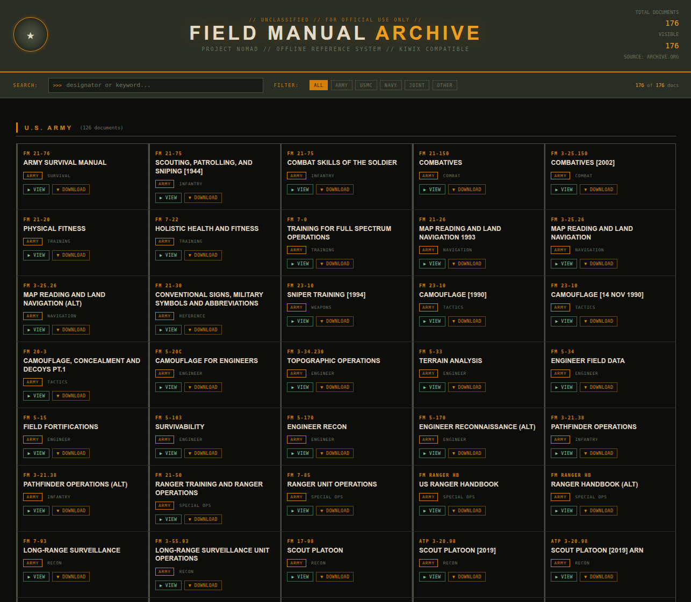

# US Military Field Manuals - Offline Archive

A self-hosted offline reference collection of US military field manuals, built for use with [Kiwix](https://kiwix.org). Part of Project Nomad.

## What This Is

This project packages ~180 public domain military field manuals (Army, USMC, Navy, Air Force, and joint publications) into a ZIM file that can be served locally via Kiwix. The source documents come from the [Internet Archive military field manuals collection](https://archive.org/details/military-field-manuals-and-guides).

The web interface has search, branch filtering, and VIEW/DOWNLOAD buttons for each document.



## Directory Structure

```
Field Manuals/
  install.sh              # downloads PDFs and builds the ZIM
  html/
    index.html            # the web interface
    illustration.png      # 48x48 icon required by zimwriterfs
    pdfs/                 # PDFs are downloaded here (not tracked by git)
```

## Setup

### 1. Install Dependencies

```bash
sudo apt install wget unzip python3 zim-tools
```

### 2. Run the Installer

```bash
chmod +x install.sh
./install.sh
```

The script will:
- Download the full PDF collection from archive.org as a single zip (~1.8GB -- expect it to take a while)
- Extract all PDFs into `html/pdfs/`
- Build `field_manuals.zim` in the current directory
- Print the deployment commands when finished

If the download gets interrupted, just re-run the script -- wget will resume where it left off and the script will offer to reuse the partial zip.

### 3. Deploy to Kiwix

Copy the ZIM to your Kiwix library folder:

```bash
cp field_manuals.zim /opt/project-nomad/storage/zim/
```

Register it with the Kiwix library (required -- Kiwix won't pick it up automatically):

```bash
docker exec nomad_kiwix_server kiwix-manage \
  /data/kiwix-library.xml add \
  /data/field_manuals.zim
```

Then restart the container:

```bash
docker restart nomad_kiwix_server
```

## Skip Flags

If you've already downloaded the PDFs and just need to rebuild the ZIM:

```bash
./install.sh --skip-download
```

If you just want the PDFs without building the ZIM:

```bash
./install.sh --skip-zim
```

## Rebuilding

If you update `index.html` or add more PDFs, re-run `install.sh --skip-download` and repeat the deploy steps. The script removes the old ZIM before building a new one.

## Dependencies

- `wget` -- downloads the PDF collection
- `unzip` -- extracts the downloaded zip
- `python3` -- generates the illustration.png icon if missing
- `zimwriterfs` -- part of the `zim-tools` package
- Docker with a running Kiwix container

## Source

All documents are public domain US government publications sourced from:
https://archive.org/details/military-field-manuals-and-guides
